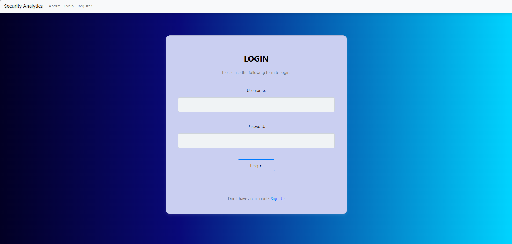

# Security Analytics: Phishing Detection & Cyberbullying Detection

**Security Analytics** is a web-based application that leverages machine learning models to detect phishing attacks and cyberbullying incidents. This platform uses data analytics and natural language processing to identify malicious patterns and provide insights into online threats. Built using **Django** for the backend and **SQLite** for data storage, the application offers a comprehensive dashboard for managing and analyzing security-related data.

---

## Key Features:

- **Phishing Detection:** Uses machine learning algorithms such as Random Forest, SVM, and XGBoost to identify phishing URLs and emails.
- **Cyberbullying Detection:** Employs text analysis techniques to detect and flag potential instances of cyberbullying in social media posts and messages.
- **User Management:** Admins can allocate cases to specific users and monitor their progress.
- **Analytics Dashboard:** Displays insights like total users, cases of cyberbullying detected, types of attacks, and phishing statistics.
- **Graphical Reports:** Visual representations of detected cases and trends using charts and graphs.

---

## Screenshots

### Home


### About


### Login


### Profile


### Dashboard


### Phishing Detection (Algorithm Comparison)


### Text Analysis Input


### Text Analysis Output


### Contact


### Graphical Report


---

## Dataset

- The **Phishing Detection** dataset includes URLs labeled as legitimate or phishing, sourced from [Phishing Websites Dataset](https://www.kaggle.com/datasets).
- The **Cyberbullying Detection** dataset includes social media posts and messages, with labels identifying whether they contain cyberbullying content.
  
These datasets are used to train the machine learning models for phishing and cyberbullying detection.

---

## Machine Learning Algorithms

### Phishing Detection Models:

1. **Random Forest:** Used for classification of phishing URLs.
2. **SVM (Support Vector Machine):** For identifying patterns in malicious data.
3. **XGBoost:** High-performance boosting algorithm for improved accuracy in phishing detection.

### Cyberbullying Detection Models:

- Natural Language Processing (NLP) is employed using **Bag-of-Words** and **TF-IDF** techniques to detect harmful and bullying language in text.

---

## REST API Endpoints:

| HTTP Method | Endpoint                        | Description                               |
|-------------|----------------------------------|-------------------------------------------|
| GET         | `/api/phishing/`                 | Fetch phishing detection results          |
| POST        | `/api/phishing/`                 | Submit a URL for phishing analysis        |
| GET         | `/api/cyberbullying/`            | Fetch cyberbullying detection results     |
| POST        | `/api/cyberbullying/`            | Submit text for cyberbullying detection   |
| GET         | `/api/dashboard/`                | View admin dashboard with statistics      |
| POST        | `/api/users/register/`           | Register a new user                       |
| POST        | `/api/users/login/`              | User login and JWT token generation       |

---

## Objectives

- **Phishing Detection:** Classify URLs and emails as phishing or legitimate using a combination of Random Forest, SVM, and XGBoost.
- **Cyberbullying Detection:** Detect cyberbullying content in text messages and social media posts using natural language processing techniques.
- **User Management:** Allow admins to assign users specific cases of phishing and cyberbullying for analysis and resolution.
- **Graphical Insights:** Provide users with visual insights into phishing attacks and cyberbullying trends.

---

## Installation Guide

### Backend (Django)

1. **Clone the repository:**

   ```bash
   git clone https://github.com/your-username/SecurityAnalytics.git
   cd SecurityAnalytics/backend
   ```

2. **Set up a virtual environment and activate it:**

   ```bash
   python3 -m venv venv
   source venv/bin/activate  # For Windows use venv\Scripts\activate
   ```

3. **Install required Python dependencies:**

   ```bash
   pip install -r requirements.txt
   ```

4. **Apply database migrations:**

   ```bash
   python manage.py migrate
   ```

5. **Run the Django development server:**

   ```bash
   python manage.py runserver
   ```

6. Open `http://127.0.0.1:8000/admin` to access the admin panel, and `http://127.0.0.1:8000/` to access the REST API.

### Frontend (Vue.js)

1. **Navigate to the frontend directory:**

   ```bash
   cd ../frontend
   ```

2. **Install npm dependencies:**

   ```bash
   npm install
   ```

3. **Run the Vue.js development server:**

   ```bash
   npm run serve
   ```

4. Open `http://localhost:8080` to view the Vue.js app in your browser.

---

## Graphical Insights

The platform provides insights into the following metrics:

- **Total Number of Users**: Displays the total number of registered users.
- **Total Number of Cases**: Shows the overall number of phishing and cyberbullying cases.
- **Number of Users Allocated**: Tracks how many users have been assigned specific cases for analysis.
- **Number of Bullying Incidents Detected**: Provides insights into the number of detected cyberbullying cases.
- **Types of Attacks**: Categorizes the types of phishing attacks and bullying behaviors detected.

---

## Testing

### Backend Tests:
To run Django tests:

```bash
python manage.py test
```

### Frontend Tests:
For testing Vue.js components:

```bash
npm run test:unit
```

---

## Future Improvements

- **Advanced Analytics:** Implement more sophisticated analytics for phishing and cyberbullying detection using real-time data feeds.
- **User Reporting:** Allow users to report phishing attempts and bullying cases from their personal dashboards.
- **Multi-Language Support:** Provide support for detecting phishing and bullying across different languages.
  
---
